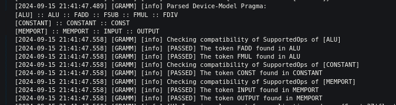

# Pragma Support:

- **SupportedOPs** pragma support added. Also, these pragmas are case-insensitive.
- **Example device-model pragma** :
```
/* ------- Device model pragma ------- 
[SupportedOps] = {ALU, FADD, FSUB, FMUL, FDIV}; 
[SupportedOps] = {MemPort, INPUT, OUTPUT}; 
[SupportedOps] = {Constant, CONST}; 
*/
```
- **Example application-graph pragma** :
```
/* ------- Application graph pragma ------- 
[SupportedOps] = {ALU, FADD, FMUL};  
[SupportedOps] = {MEMPORT, input, output};
[SupportedOps] = {Constant, const};
*/
```
- **Syntax** :: [<-Keyword->] = {nodeType, supportedOp1, supportedOp2, supportedOp3};
- **Syntax** :: [SupportedOps] = {ALU, FADD, FMUL}; //"ALU" nodeType supports FADD and FALU opcodes.
- `void readDeviceModelPragma()` and `void readApplicationGraphPragma()` handles reading of Pragmas from both the graphs, and also checks the compatibility and correctness of these pragmas.

<div style="text-align: center;">
    
    <figcaption style="font-size: 14px; color: #555;">Fig 1. Pragma Check Example</figcaption>
</div>

- `compatibilityCheck(hOpcode, gType)`: Checks whether the current opcode required by the application node is supported by the device model node.
    - This function determines if the opcode needed by the application node (represented by `hOpcode`) is compatible with or supported by the device model node type (represented by `gType`).