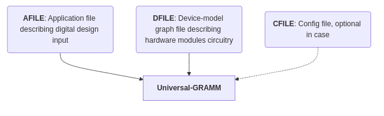

# Mapping Digital Circuits to Hardware Modules

{: .note }
Please refer to the [Getting Started Guide](https://universalgramm.github.io/getting-started) of UGRAMM before attempting this tutorial.

# Table of Contents

1. [Description](#description)
2. [Application-dot file](#application-dot-file)
3. [Device-model file](#device-model-file)
4. [Running UGRAMM](#running-ugramm)

## Description:

UGRAMM is a flexibile tool which can be used not only for CGRA mapping but for any application where we need to find embedding of a small graph in a large graph.

In this tutorial, we have mapped a digital design input to hardware modules. Here, mapping refers to the one-to-one correspondence between a specific operation in the smaller input digital design graph and the hardware available in the larger graph, also known as the device model.

<div style="text-align: center;">
  
</div>

--- 

## Application-dot file:

<div style="text-align: center;">
  <table style="margin: auto;">
    <tr>
        <td align="center">
        
        <br> <b>Digital Circuit Design</b>
        </td>
        <td align="center">
        
        <br> <b>Digital Circuit Design in Dot Format </b>
        </td>
    </tr>
  </table>
</div>

### Application Dot File Overview 

> **AFile Location:** `UGRAMM/tutorial/tut1/application.dot`
  
As illustrated in Fig 1, the digital circuit design of a two-input AND gate can also be represented in [Graphviz dot format](https://graphviz.org/doc/info/lang.html). The conversion of this circuit into dot format is provided below in the provided code snippet, along with the graph output shown in Fig 2.

In the application dot file, all nodes are classified as **Function Cells (FuncCells)** according to the UGRAMM framework. For more details, refer to the defined cell types of UGRAMM [here](/UGRAMM-Documentations/node-type).

### PRAGMA Section

The dot file begins with a **PRAGMA** statement, which is followed by the main content of the dot file. The PRAGMA specifies the supported operations for a FuncCell in a format defined by UGRAMM. More information about the supported pragmas can be found [here](/UGRAMM-Documentations/Supported-Pragmas.html). 

For instance, a gate is represented as a FuncCell in the application file. A supported operation for this gate is AND, which is defined in the PRAGMA as follows:

> "GATE" : ["AND"]

### Application Dot Attributes Overview

| **Type**      | **Attribute** | **Description**                                                      | **Example**                        |
|---------------|---------------|----------------------------------------------------------------------|------------------------------------|
| Node          | **label**     | The display name of the node, shown in graphical representations.   | `label="Input1"`                    |
| Node          | **opcode**    | Specifies the opcode of the FuncCell, indicating its functionality.   | `opcode=INPUT` or `opcode=AND`    |
| Node          | **width**     | Specifies the width of the node for graphical representation.         | `width="5"`  |
| Edge          | **driver**    | Specifies the driver pin to use for the connection  | `driver="outPinA"`             |
| Edge          | **load**      | Specifies the load pin to use for the connection | `load="inPinA"`                   |

- **Example:** `Input1 -> And1  [driver="outPinA", load="inPinA"];`
  - UGRAMM will establish a connection from Input1's `outPinA` to And1's `inPinA`.
  - Both FuncCells must have the required pins defined in the device-model dot file with matching names; otherwise, UGRAMM will throw a FATAL ERROR.


```js
/*
{
    "GATE" : ["AND"],
    "IO" : ["INPUT", "OUTPUT"]
}
*/
strict digraph "tutorialUGRAMM" {

//Node information:
Input1 [label="Input1", opcode=INPUT];  //Input-IO node 
Input2 [label="Input2", opcode=INPUT];  //Input-IO node 
And1 [label="And1", opcode=AND];        //And-gate defined as GATE node
Output [label="Output1", opcode=OUTPUT]; //Output-IO node

//Edge information:
Input1 -> And1  [driver="outPinA", load="inPinA"];
Input2 -> And1  [driver="outPinA", load="inPinB"];
And1 -> Output  [driver="outPinA", load="inPinA"];
}
```

--- 

## Device-model file:

<div style="text-align: center;">
  
  <br> <b> Fig 3. Device model </b>
</div>

### Device-model Dot File Overview 

> **DFile Location:** `UGRAMM/tutorial/tut1/device-model.dot`

The device-model dot file illustrates the available hardware modules and their interconnections within the system. UGRAMM aims to embed a smaller application graph into this larger device model graph. The circuitry shown in Fig 3 can also be represented in dot format, as shown in the code snippet below or in `tut1/device-model.dot`.

In contrast to the application dot file, the device model includes all three cell types: **FuncCell**, **RouteCell**, and **PinCell**. In UGRAMM, every **FuncCell** must have output and/or input pin interfaces. These **FuncCells** are interconnected using these pins, often with **RouteCells** facilitating the connections in between.

For example, the connection between the **Gate FuncCell** shown in the Fig 3. and the far-right **IO FuncCell** can be described as follows: **{outPin of Gate, Reg (RouteCell), inputPin of IO, IO (FuncCell)}**.

Each cell-type in UGRAMM has its associated opcodes. For example, a **PinCell** may include opcodes such as **IN** and **OUT** describing Input pin cells and Output pin cells respectively. The details are outlined as follows:

<div style="text-align: center;">
  
</div>

### PRAGMA Section

The device-model dot file begins with a **PRAGMA** statement, similar to the application dot file, which specifies the operations supported by various FuncCells within the device model.

It is important to ensure that the operations defined in the device model align with the requirements specified in the application dot file's PRAGMA. For example, if the application dot file requests a NOR operation from a GATE FuncCell, but the device model only supports an AND operation for GATE FuncCell, then MAPPING will not be feasible.

For example, the PRAGMA section is defined as follows:

```js
/*
{
    "GATE" : ["AND"],
    "IO" : ["INPUT", "OUTPUT"]
}
*/
```

### Device-model Dot Attributes Overview

| **Required/Optional**      | **Attribute** | **Description**                                                      | **Example**                        |
|---------------|---------------|----------------------------------------------------------------------|------------------------------------|
| Required          | **G_Name**    | The unique name of the node        | `G_Name="IO1.inPinA"`             |
| Required          | **G_CellType**| Specifies the type of the cell (e.g., PinCell, FuncCell, RouteCell).          | `G_CellType="PinCell"`             |
| Required          | **G_NodeType**| Indicates the opCode of the node in the architecture (e.g., PinCell supports IN, OUT).| `G_NodeType="IN"`                  |
| Optional          | **G_VisualX** | The X-coordinate for visual representation in the layout.          | `G_VisualX="0"`                    |
| Optional          | **G_VisualY** | The Y-coordinate for visual representation in the layout.          | `G_VisualY="3"`                    |
| Optional               | **G_Width**     | Width of the hardware node.                                                                           | `G_Width="32"`                     |

<details>
<summary> <b> Device Model Pragma Code </b> </summary>
<div class="code-example" markdown="1">
```js
/*
{
    "GATE" : ["AND"],
    "IO" : ["INPUT", "OUTPUT"]
}
*/
strict digraph  {
0  [G_Name="IO1.inPinA", G_CellType="PinCell", G_NodeType="IN", G_VisualX="0", G_VisualY="3", G_Width="32"];
1  [G_Name="IO1", G_CellType="FuncCell", G_NodeType="IO", G_VisualX="0.75", G_VisualY="3", G_Width="32"];
2  [G_Name="IO1.outPinA", G_CellType="PinCell", G_NodeType="OUT", G_VisualX="1.5", G_VisualY="3", G_Width="32"];

3  [G_Name="IO2.inPinA", G_CellType="PinCell", G_NodeType="IN", G_VisualX="0", G_VisualY="1", G_Width="32"];
4  [G_Name="IO2", G_CellType="FuncCell", G_NodeType="IO", G_VisualX="0.75", G_VisualY="1", G_Width="32"];
5  [G_Name="IO2.outPinA", G_CellType="PinCell", G_NodeType="OUT", G_VisualX="1.5", G_VisualY="1", G_Width="32"];

6 [G_Name="MUX1", G_CellType="RouteCell", G_NodeType="MUX", G_VisualX="2.5", G_VisualY="3", G_Width="32"];
7 [G_Name="MUX2", G_CellType="RouteCell", G_NodeType="MUX", G_VisualX="2.5", G_VisualY="1", G_Width="32"];

8  [G_Name="Gate1.inPinA", G_CellType="PinCell", G_NodeType="IN", G_VisualX="3", G_VisualY="3", G_Width="32"];
9  [G_Name="Gate1.inPinB", G_CellType="PinCell", G_NodeType="IN", G_VisualX="3", G_VisualY="1", G_Width="32"];
10  [G_Name="Gate1", G_CellType="FuncCell", G_NodeType="GATE", G_VisualX="3.75", G_VisualY="2", G_Width="32"];
11  [G_Name="Gate1.outPinA", G_CellType="PinCell", G_NodeType="OUT", G_VisualX="4.5", G_VisualY="2", G_Width="32"];

12 [G_Name="REG1", G_CellType="RouteCell", G_NodeType="REG", G_VisualX="5.5", G_VisualY="2", G_Width="32"];

13  [G_Name="IO3.inPinA", G_CellType="PinCell", G_NodeType="IN", G_VisualX="6", G_VisualY="2", G_Width="32"];
14  [G_Name="IO3", G_CellType="FuncCell", G_NodeType="IO", G_VisualX="6.75", G_VisualY="2", G_Width="32"];
15  [G_Name="IO3.outPinA", G_CellType="PinCell", G_NodeType="OUT", G_VisualX="7.5", G_VisualY="2", G_Width="32"];


//1st I/O layer:
0 -> 1; //Connection of input pin to the I/O block
1 -> 2; //Connection of I/O block to the output pin 

3 -> 4; //Connection of input pin to the I/O block
4 -> 5; //Connection of I/O block to the output pin 

//Interconnect layer:
2 -> 6;
5 -> 6;

2 -> 7;
5 -> 7;

//Gate layer:
6 -> 8;
7 -> 9;
8 -> 10;
9 -> 10;
10 -> 11;

//Reg layer:
11 -> 12;

//I/O layer:
12 -> 13;
13 -> 14;
14 -> 15;
}
```
</div>
</details>

--- 

## Config file for Locking:

> **Config file Location:** `UGRAMM/tutorial/tut1/config.json`

UGRAMM enables locking specific nodes from the application graph to designated nodes in the device model graph. Additional details on this process are available [here](/UGRAMM-Documentations/config-file/node-locking). Below is the configuration file for this tutorial:

```
{
    "lock-nodes" : ["Input1::IO1", "Input2::IO2"]
}
```

In this configuration, the `Input1` node from the application graph is locked to the `IO1` node in the device model, and similarly, `Input2` is locked to `IO2`. These constraints are prioritized during routing, guiding the output mapping according to the locking information. As shown in the output, `Input1` is mapped to `IO1` and `Input2` to `IO2` as specified.

--- 

## Running UGRAMM:

UGRAMM mapping algorithm is described in detailed in this [paper](https://ieeexplore.ieee.org/document/10296406)

```
cd tutorial/tut1/
./../../UGRAMM --config config.json --afile application.dot --dfile device-model.dot && dot -Tpng unpositioned_dot_output.dot -o unpositioned_dot_output.png && neato -Tpng positioned_dot_output.dot -o positioned_dot_output.png 
```

When no `--seed` value is passed to the UGRAMM, a default value of `0` is considered. The same applies to the verbose level of the toolchain. When `--verbose_level` is not specified, a default level of `0` (or `info`) is used. It can also be set to `1` for debug or `2` for trace.

### Output of UGRAMM:

```
[2024-10-26 21:25:43.738] [UGRAMM] [info] Parsed Device-Model Pragma: 
[GATE] :: GATE :: AND
[IO] :: IO :: INPUT :: OUTPUT
[2024-10-26 21:25:43.739] [UGRAMM] [info] Checking compatibility of SupportedOps of [GATE]
[2024-10-26 21:25:43.739] [UGRAMM] [info] [PASSED] The token AND found in GATE
[2024-10-26 21:25:43.739] [UGRAMM] [info] Checking compatibility of SupportedOps of [IO]
[2024-10-26 21:25:43.739] [UGRAMM] [info] [PASSED] The token INPUT found in IO
[2024-10-26 21:25:43.739] [UGRAMM] [info] [PASSED] The token OUTPUT found in IO
[2024-10-26 21:25:43.739] [DRC Checks] [info] --------------------------------------------------
[2024-10-26 21:25:43.739] [DRC Checks] [info] Executing DRC Rules Check
[2024-10-26 21:25:43.739] [DRC Checks] [info] --------------------------------------------------
[2024-10-26 21:25:43.739] [DRC Checks] [info] --------------------------------------------------
[2024-10-26 21:25:43.739] [DRC Checks] [info] DRC Passed --- Continueing to UGRAMM Mapping
[2024-10-26 21:25:43.739] [DRC Checks] [info] --------------------------------------------------
[2024-10-26 21:25:43.739] [UGRAMM] [info] ***** BEGINNING OUTER WHILE LOOP ***** ITER 1
[2024-10-26 21:25:43.740] [UGRAMM] [info] TOTAL OVERUSE: 0
[2024-10-26 21:25:43.740] [UGRAMM] [info] FRACTION OVERLAP: 0
[2024-10-26 21:25:43.740] [UGRAMM] [info] SUCCESS! :: [iterCount] :: 1 :: [frac] :: 0 :: [num_vertices(H)] :: 4
[2024-10-26 21:25:43.740] [UGRAMM] [info] ** routing for And1 | (GATE1)'s output pin :: 
[2024-10-26 21:25:43.740] [UGRAMM] [info]        3       GATE1.OUTPINA
[2024-10-26 21:25:43.740] [UGRAMM] [info]        4       REG1
[2024-10-26 21:25:43.740] [UGRAMM] [info]        5       IO3.INPINA
[2024-10-26 21:25:43.740] [UGRAMM] [info] ** routing for Input1 | (IO1)'s output pin :: 
[2024-10-26 21:25:43.740] [UGRAMM] [info]        8       IO1.OUTPINA
[2024-10-26 21:25:43.740] [UGRAMM] [info]        12      MUX1
[2024-10-26 21:25:43.740] [UGRAMM] [info]        14      GATE1.INPINA
[2024-10-26 21:25:43.740] [UGRAMM] [info] ** routing for Input2 | (IO2)'s output pin :: 
[2024-10-26 21:25:43.740] [UGRAMM] [info]        11      IO2.OUTPINA
[2024-10-26 21:25:43.740] [UGRAMM] [info]        13      MUX2
[2024-10-26 21:25:43.740] [UGRAMM] [info]        15      GATE1.INPINB
[2024-10-26 21:25:43.740] [UGRAMM] [info] ** routing for Output1 | (IO3)'s output pin :: 
[2024-10-26 21:25:43.740] [UGRAMM] [info]        Empty vertex model (no-fanouts for the node)
[2024-10-26 21:25:43.740] [UGRAMM] [info] Writing the positioned mapping output in file 'positioned_dot_output.dot'
[2024-10-26 21:25:43.740] [UGRAMM] [info] Writing the unpositioned mapping output in file 'unpositioned_dot_output.dot'
[2024-10-26 21:25:43.740] [UGRAMM] [info] Total time taken for [DRC] :: 0.000156 Seconds
[2024-10-26 21:25:43.740] [UGRAMM] [info] Total time taken for [mapping] :: 0.000555 Seconds
[2024-10-26 21:25:43.740] [UGRAMM] [info] Total time taken for [UGRAMM]:: 0.001951 Seconds
```

### unpositioned_dot_output 
- This dot-file does not contains user provided co-ordinates of the device-model node cells.
- This file also displays the input application graph for which UGRAMM was executed.
<div style="text-align: center;">
  
  <br> <b> Fig 4. unpositioned_dot_output </b>
</div>

### positioned_dot_output

- This dot-file contains user provided co-ordinates of the device-model node cells.

<div style="text-align: center;">
  
  <br> <b> Fig 5. positioned_dot_output </b>
</div>
