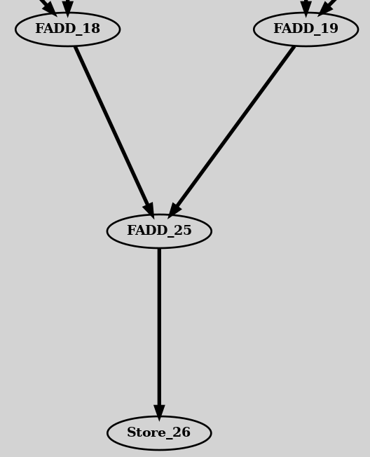
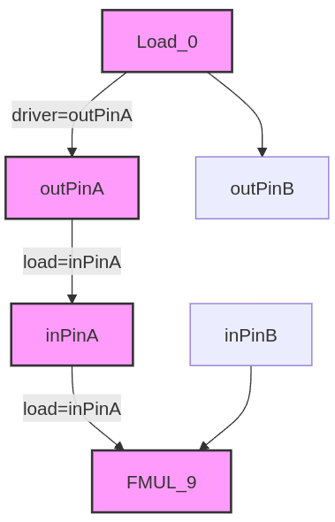

# Input application for UGRAMM:

<div style="text-align: center;">
    
    <figcaption style="font-size: 14px; color: #555;">Fig 1. Data Flow Graph (DFG) Example</figcaption>
</div>

In a CGRA, the input application is usually represented as a Data Flow Graph (DFG), where vertices correspond to operations like ADD, SUB, and MUL, and the edges between these vertices indicate the dependencies among these operations. UGRAMM comes with various CGRA benchmarks designed for HPC applications, including Convolution, FFT, and Stencil, with both Balanced and Unbalanced versions. Additionally, each benchmark type supports different unrolling factors ranging from 1 to 10.

```
├── Kernels
├── Conv_nonBalance
├── Stencil_Balance
└── Stencil_nonBalance
├── Conv_nonBalance
│   ├── conv_nounroll_Any.dot
│   ├── conv_nounroll_nonBalance_Any.dot
│   ├── conv_nounroll_nonBalance_Specific.dot
│   ├── conv_nounroll_Specific.dot
│   ├── conv_unroll2_Any.dot
│   ├── conv_unroll2_nonBalance_Any.dot
│   ├── conv_unroll2_nonBalance_Specific.dot
│   ├── conv_unroll2_Specific.dot
│   ├── conv_unroll3_Any.dot
│   ├── conv_unroll3_nonBalance_Any.dot
│   ├── conv_unroll3_nonBalance_Specific.dot
│   └── conv_unroll3_Specific.dot
├── FFT-Radix-4
│   ├── fft_radix4_Any.dot
│   ├── fft_radix4_Specific.dot
│   ├── fft_radix4_unroll2_Any.dot
│   └── fft_radix4_unroll2_Specific.dot
├── FFT-Radix-5
│   ├── fft_radix5_Any.dot
│   └── fft_radix5_Specific.dot
```

- These benchmarks are defined in the Graphviz DOT format [(ref)](https://graphviz.org/doc/info/lang.html). 

```
//Node/Vertex definition:
FADD_19 [label="{FADD_19}", opcode=FADD, width=32];
FADD_18 [label="{FADD_18}", opcode=FADD, width=32];

//Edge definition:
Load_0 -> FMUL_9  [driver=outPinA, load="inPinA"];
Load_1 -> FMUL_10  [driver=outPinA, load="inPinA"];
```

## Required and optional attributes in application-dot file.


| **Type**      | **Required/Optional** | **Attribute**     | **Description**                                                                                       | **Example**                          |
|---------------|------------------------|-------------------|-------------------------------------------------------------------------------------------------------|--------------------------------------|
| Node          | **Required**           | **label**         | Specifies the operation name in the application graph.                                               | `label="{Load_0}"`                  |
| Node          | **Required**           | **opcode**        | Specifies the operation's opcode, indicating its functionality.                                       | `opcode="input"`                     |
| Node          | Optional           | **width**         | Specifies the width of the node for graphical representation.                                         | `width="5"`                          |
| Edge          | **Required**           | **driver**        | Specifies the driver pin to use for the edge connection.                                             | `driver="outPinA"`                  |
| Edge          | **Required**           | **load**          | Specifies the load pin to use for the edge connection.                                               | `load="inPinA"`                      |
| Edge          | Optional           | **latency**       | Specifies the latency requirement for the edge.                                                      | `latency="2.0"`                     |

**Example Usage**: `Load_0 -> FMUL_9 [driver=outPinA, load=inPinA];`  
In this example, UGRAMM selects the `outPinA` of the device-model node where `Load_0` is mapped and routes it to the `inPinA` of the device-model node where `FMUL_9` is mapped. For UGRAMM to function as expected, the device model must have nodes with pins defined as `outPinA`, `inPinA`, `B`, etc.

<div style="text-align: center;">
    
    <figcaption style="font-size: 14px; color: #555;">Fig 2. edge-attribute Example</figcaption>
</div>

The **[Required]** node and edge attributes must be clearly defined in the `application.dot` file (when used as an `afile` input) to ensure UGRAMM operates correctly.

Each CGRA-benchmark has two version in UGRAMM:
  - **Any**: In this type, `loadPins` are not specified or constrained and default to `Any2Pins`. This serves as a useful comparison point with the classic GRAMM model.
  - **Specific**: This type includes benchmark where only a single `loadPin` is specified.

Also, supported operations for both device-model and application-graph are defined as `pragma` which is defined within dot file itself which is covered [here](/UGRAMM-Documentations/Supported-Pragmas)
