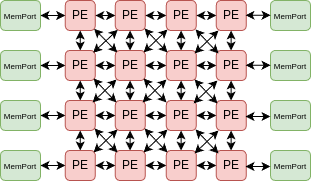

# Device model input:

The device model graph is a larger graph used to determine if the application graph is a minor of it. As implied by its name, the device model dot file captures the graphical representation of the hardware architecture targeted for mapping the input application. CGRA architectures, such as RIKEN and ADRES, can be converted into this graphical dot format. To streamline the process of generating these graphical dot files, a script (`scripts/device-model-gen.py`) has been developed to easily create dot graph format files for standard CGRAs. Currently, this script supports RIKEN and ADRES ***[Work In Progess]*** architectures.

The next section will provide an overview of how the script operates and represents the architecture in graph format. This information may serve as a foundation for creating similar scripts tailored to new GRAMM applications that require automated device model generation.

## Device model generation script:
- **Usage:** `device_model_gen.py [-h] [-NR NR] [-NC NC] [-Arch ARCH]`
    - NR (Number of rows), NC (Number of columns), and Arch (name of architecture)
- **Example:** `./device_model_gen.py -NR 8 -NC 8 -Arch RIKEN`
- Generates a device model for the specified CGRA architecture.
- When the script is executed, the output will be saved as `<Arch_Name>_<NR>_<NC>.dot`.
- **Architecture supported:**
    - RIKEN
    - ADRES ***[Work In Progess]***
- Script generation example for RIKEN CGRA architecture:
    - RIKEN hardware architecture:
<div style="text-align: center;">
    
    <figcaption style="font-size: 14px; color: #555;">Fig 1. RIKEN hardware architecture</figcaption>
</div>

<div style="text-align: center;">
    
    <figcaption style="font-size: 14px; color: #555;">Fig 2. RIKEN Processing Element (PE)</figcaption>
</div>

- Visualize ouput of RIKEN PE by device model gen script: 
<div style="text-align: center;">
    
    <figcaption style="font-size: 14px; color: #555;">Fig 3. Visualize graph ouput of RIKEN PE</figcaption>
</div>

- Device model graph output file example:
```
33 [G_Name="LS.w32.c7.r5.memport", G_CellType=FuncCell, G_NodeType=MemPort, G_VisualX=7, G_VisualY="6.9"];
34 [G_Name="LS.w32.c7.r5.memport.inPinA", G_CellType=PinCell, G_NodeType=in, G_VisualX=7, G_VisualY="7.3"];
35 [G_Name="LS.w32.c7.r5.memport.outPinA", G_CellType=PinCell, G_NodeType=out, G_VisualX=7, G_VisualY="6.5"];
36 [G_Name="pe.w32.c1.r0.crossbar_mux_0", G_CellType=RouteCell, G_NodeType=Mux];
37 [G_Name="pe.w32.c1.r0.crossbar_mux_1", G_CellType=RouteCell, G_NodeType=Mux];
38 [G_Name="pe.w32.c1.r0.crossbar_mux_2", G_CellType=RouteCell, G_NodeType=Mux];
33 -> 35;
34 -> 33;
```

## Required and optional attributes in device-model dot file:

| **Required/Optional** | **Attribute**   | **Description**                                                                                       | **Example**                         |
|------------------------|-----------------|-------------------------------------------------------------------------------------------------------|-------------------------------------|
|**Required**               | **G_Name**      | Unique name of the cell in the device model graph.                                                    | `G_Name="pe.w32.c1.r0.alu"`        |
| **Required**               | **G_CellType**  | Type of the cell, specifying its function (`FuncCell`, `RouteCell`, or `PinCell`).                    | `G_CellType="FuncCell"`            |
| **Required**               | **G_NodeType**  | Node type within the cell (e.g., `ALU`, `MEMPORT` for `FuncCell`).                                    | `G_NodeType="ALU"`                 |
| Optional               | **G_VisualX**   | X location for visualization purposes.                                                                | `G_VisualX="10"`                   |
| Optional               | **G_VisualY**   | Y location for visualization purposes.                                                                | `G_VisualY="5"`                    |
| Optional               | **G_Width**     | Width of the hardware node.                                                                           | `G_Width="32"`                     |

The **[Required]** attributes must be defined in the `device-model.dot` file (`dfile` input) to ensure UGRAMM operates correctly.

Also, supported operations for both device-model and application-graph are defined as `pragma` which is defined within dot file itself which is covered [here](/UGRAMM-Documentations/Supported-Pragmas)