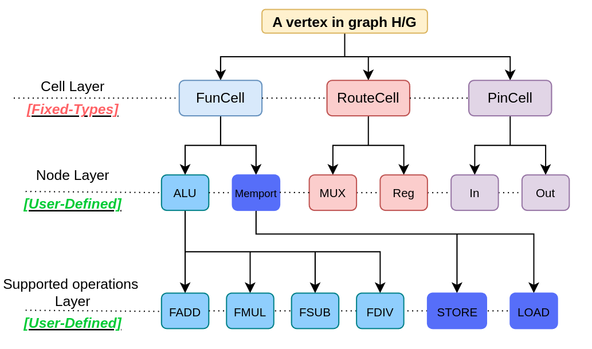

# Graph Vertex Generalization:

    
    <figcaption style="font-size: 14px; color: #555;">Fig 1.Graph Vertex Generalization</figcaption>

As outlined in the getting started guide, both the input application and hardware architecture are represented as graphs in UGRAMM. The vertex of the application graph (H) and device model graph (G) are designed to be versatile, making them applicable not only to CGRA applications but also adaptable to other use cases with minimal adjustments.

As shown in Fig.1, a vertex in graphs H or G can contain layered information describing its function:

1. **Cell Layer**: Specifies if the vertex is used for routing or functional operations.
2. **Node Layer**: Indicates the name/type of the node under the selected cell type.
3. **Supported Ops Layer**: For functional cells (e.g., `FuncCell`), lists operations the cell supports.

### CellType Categories
Each vertex must fall into one of these `CellType` categories:

- **FuncCell**: Represents a functional cell, typically performing operations such as arithmetic (e.g., ALU) or memory-related operations like load/store (e.g., IO/MemPort).
- **RouteCell**: Represents a routing cell, such as a multiplexer (MUX) or register, which is crucial for connecting two `FuncCell`s within the hardware.
- **PinCell**: Represents a pin cell. Each functional cell must have defined input and output pins. For example, a 2-input ALU typically found in CGRA will have two input pins and one output pin in UGRAMM. UGRAMM utilizes these pins during the mapping process to manage properties such as commutativity when needed.

| **Attribute**       | **Description**                                                                                                | **Example Values**                 |
|---------------------|----------------------------------------------------------------------------------------------------------------|------------------------------------|
| **CellType** **[Fixed]**       | Defines the primary role of the vertex.                                                                        | `FuncCell`, `RouteCell`, `PinCell` |
| **NodeType**   **[Generalized]**     | Defines the name/type of the vertex                                               | `ALU`, `MemPort`, `LUT`, `DSP`     |
| **Supported Ops**  **[Generalized]** | Operations or opcodes that functional cells (`FuncCell`) can execute.                                          | `Add`, `Multiply`, `Store`         |

For a vertex, the `CellType` **[Fixed]** must be `FuncCell`, `RouteCell`, or `PinCell`, while the `NodeType` and `SupportedOPs` **[Flexible]** are user-defined (e.g., `ALU`, `MemPort` in CGRA or `LUT`, `DSP` in FPGA), these are parsed as attributes from input graphs in [Graphviz DOT format](https://graphviz.org/doc/info/lang.html).

## Device-Model Vertex Examples:

The device model can incorporate all three `CellType` categories (`FuncCell`, `RouteCell`, `PinCell`) as shown below:

An ALU `NodeType` defined as a `FuncCell` is represented as follows:

- `50 [G_Name="pe.w32.c1.r0.alu", G_CellType=FuncCell, G_NodeType=ALU];`

Similarly, other `CellType` and `NodeType` combinations are defined within the device model:

- A out (pin) `NodeType` defined as a `PinCell` as follows:
    - `49 [G_Name="LS.w32.c7.r5.memport.outPinA", G_CellType=PinCell, G_NodeType=out];`

- A MUX `NodeType` defined as a `RouteCell` as follows:
    - `20 [G_Name="pe.w32.c1.r0.crossbar_mux_0", G_CellType=RouteCell, G_NodeType=Mux];`

For additional details, refer to the [device model file documentation](/UGRAMM-Documentations/device-model-file).

## Application-Graph Vertex Examples:

- As outlined in the [application file input documentation](/UGRAMM-Documentations/application-file), the application file defaults to having all vertices to be of `FuncCell` type. Other important attributes of this graph are also discussed there.

Also, supported operations for both device-model and application-graph are defined as `pragma` which is defined within dot file itself which is covered [here](/UGRAMM-Documentations/Supported-Pragmas)