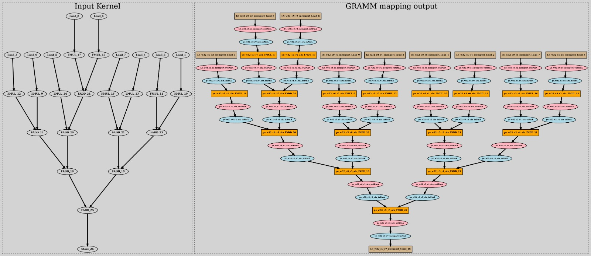

## Skip Placement:

In some situation, users may need to skip the placement of specific opcodes or NodeTypes during the mapping process of UGRAMM. To do this, they need to include a tag called `skip-placement` in the config file followed by a string list of Opcodes (FADD, FMUL) or NodeTypes (ALU, Memport) that need to be excluded during placement as seen below. Do node that the values provided in the JSON file are case-insensitive. However, the key `skip-placement` is case-sensitive to lower case characters. 
```
skip-placement" : [<-String list of Opcodes or NodeTypes->];
```

To provide some examples on skip placements, lets first skip over the placement of an opcode. The following example shows a situation where UGRAMM mapping is skipping over the placement of the constant through the opcode ("const"). To do this, we provide the opcodes as input to the `skip-placement` tag. 

- config.json:
```
{
  "skip-placement" : ["const"]
}
```
- output:
```
[2024-09-15 21:41:52.355] [GRAMM] [info] [H] Ignoring placement for application node :: {Const_27|float32=5.00} 
[2024-09-15 21:41:52.355] [GRAMM] [info] [H] Ignoring placement for application node :: {Const_28|float32=13.00} 
[2024-09-15 21:41:52.355] [GRAMM] [info] [H] Ignoring placement for application node :: {Const_29|float32=9.00} 
[2024-09-15 21:41:52.355] [GRAMM] [info] [H] Ignoring placement for application node :: {Const_30|float32=11.00} 
[2024-09-15 21:41:52.355] [GRAMM] [info] [H] Ignoring placement for application node :: {Const_31|float32=3.00} 
[2024-09-15 21:41:52.355] [GRAMM] [info] [H] Ignoring placement for application node :: {Const_32|float32=15.00} 
[2024-09-15 21:41:52.355] [GRAMM] [info] [H] Ignoring placement for application node :: {Const_33|float32=17.00} 
[2024-09-15 21:41:52.355] [GRAMM] [info] [H] Ignoring placement for application node :: {Const_34|float32=7.00} 
[2024-09-15 21:41:52.355] [GRAMM] [info] [H] Ignoring placement for application node :: {Const_35|float32=19.00} 
```
<div style="text-align: center;">
    
    <figcaption style="font-size: 14px; color: #555;">Fig 1. Mapping output of Example 1 (Constants skipped for placement and route)</figcaption>
</div>

As mentioned, UGRAMM can also skip over NodeTypes as shown below. In this case, the UGRAMM is skipping the placement of constant through not mapping any application DFG node that has the nodeType ("constant"). To to this, we provide the NodeType as input to the `skip-placement` tag. 

- config.json:
```
{
  "skip-placement" : ["Constant"]
}
```
- output:
    - Same output as the example 1. 


That being said, we can provide both opcodes and nodeTypes as input to the `skip-placement` tag shown below. In this case, we are typing to skip over constant, memport, and FMUL. 
- config.json:
    - Constant & Memport are NodeType (meaning all opcodes under these nodeTypes will be skipped for place and route) and FMUL is a Opcode 
```
{
  "skip-placement" : ["Constant", "Memport", "FMUL"]
}
```
- output:
<div style="text-align: center;">
    
    <figcaption style="font-size: 14px; color: #555;">Fig 2. Skipping of specified nodeType and opcodes in Example 3</figcaption>
</div>

<div style="text-align: center;">
    
    <figcaption style="font-size: 14px; color: #555;">Fig 3. Mapping output of Example 3 (Constants, Memport, and FMUL skipped for placement and route)</figcaption>
</div>
