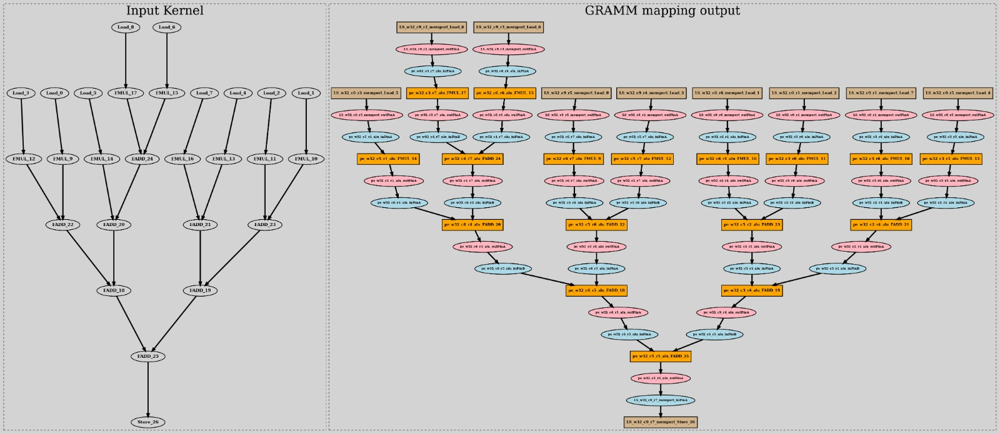
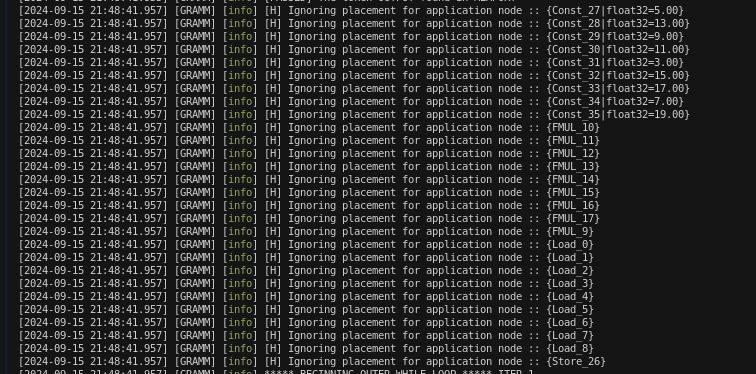
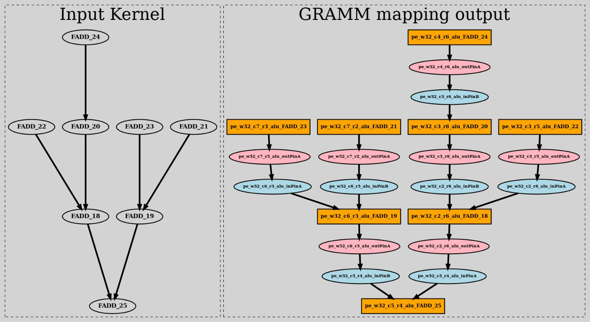

## UGRAMM config file:

- Input JSON file support for configuration related parameters. As of now supports Placement pragma.
    - Library used: #include "../lib/json.h"
        - https://github.com/nlohmann/json
- For placement configuration:
    - "skip-placement" : [<-String list of Opcodes or NodeTypes->]; //Both **opcode**(FADD, FALU) or **nodeType**(ALU, Memport) are supported.
    - Also note that both the keys and values in the JSON file are case-insensitive.

---

### Example1: Skipping placement of constant using the opcode ("const") as an Input

- config.json:
```
{
  "skip-placement" : ["const"]
}
```
- output:
```
[2024-09-15 21:41:52.355] [GRAMM] [info] [H] Ignoring placement for application node :: {Const_27|float32=5.00} 
[2024-09-15 21:41:52.355] [GRAMM] [info] [H] Ignoring placement for application node :: {Const_28|float32=13.00} 
[2024-09-15 21:41:52.355] [GRAMM] [info] [H] Ignoring placement for application node :: {Const_29|float32=9.00} 
[2024-09-15 21:41:52.355] [GRAMM] [info] [H] Ignoring placement for application node :: {Const_30|float32=11.00} 
[2024-09-15 21:41:52.355] [GRAMM] [info] [H] Ignoring placement for application node :: {Const_31|float32=3.00} 
[2024-09-15 21:41:52.355] [GRAMM] [info] [H] Ignoring placement for application node :: {Const_32|float32=15.00} 
[2024-09-15 21:41:52.355] [GRAMM] [info] [H] Ignoring placement for application node :: {Const_33|float32=17.00} 
[2024-09-15 21:41:52.355] [GRAMM] [info] [H] Ignoring placement for application node :: {Const_34|float32=7.00} 
[2024-09-15 21:41:52.355] [GRAMM] [info] [H] Ignoring placement for application node :: {Const_35|float32=19.00} 
```
<div style="text-align: center;">
    
    <figcaption style="font-size: 14px; color: #555;">Fig 1. Mapping output of Example 1 (Constants skipped for placement and route)</figcaption>
</div>
---

### Example2: Skipping placement of constant using the nodeType ("constant") as an Input
- config.json:
```
{
  "skip-placement" : ["Constant"]
}
```
- output:
    - Same output as the example 1. 

---

### Example3: Skipping placement of constant, memport and FMUL.
- config.json:
    - Constant & Memport are NodeType (meaning all opcodes under these nodeTypes will be skipped for place and route) and FMUL is a Opcode 
```
{
  "skip-placement" : ["Constant", "Memport", "FMUL"]
}
```
- output:
<div style="text-align: center;">
    
    <figcaption style="font-size: 14px; color: #555;">Fig 2. Skipping of specified nodeType and opcodes in Example 3</figcaption>
</div>

<div style="text-align: center;">
    
    <figcaption style="font-size: 14px; color: #555;">Fig 3. Mapping output of Example 3 (Constants, Memport, and FMUL skipped for placement and route)</figcaption>
</div>
