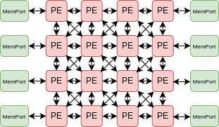
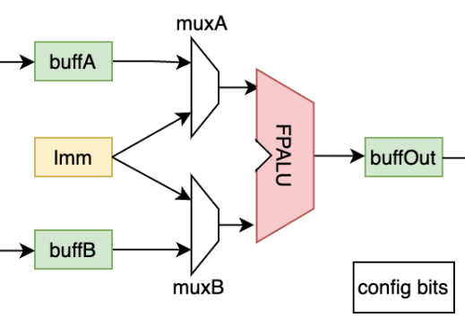
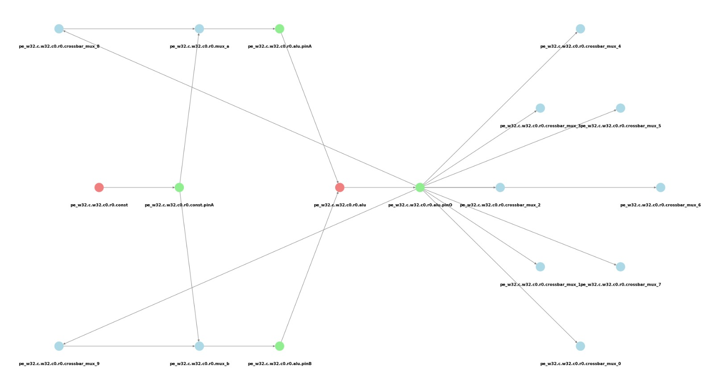

# Device model input:

- The device model graph is a larger graph used to determine whether the application graph is a minor of it. As the name suggests, the device model dot file represents the graphical format of the hardware architecture onto which we aim to map the input application.

- CGRA architectures such as RIKEN and ADRES can be converted into graphical dot format. To simplify the generation of graphical dot files of these architectures, we have created a script in `scripts/device-model-gen.py` that can easily generate a dot graph format file for standard CGRAs, and right now it supports RIKEN and ADRES architectures.

- The following section will explain how the script functions and how the architecture is represented in graph format, which may inspire the creation of a similar script for new GRAMM applications requiring automated device model generation.

## Device model generation script:
- **Usage:** `device_model_gen.py [-h] [-NR NR] [-NC NC] [-Arch ARCH]`
    - NR (Number of rows), NC (Number of columns), and Arch (name of architecture)
- **Example:** `./device_model_gen.py -NR 8 -NC 8 -Arch RIKEN`
- Generates a device model for the specified CGRA architecture.
- When the script is executed, the output will be saved as `<Arch_Name>_<NR>_<NC>.dot`.
- **Architecture supported:**
    - RIKEN
    - ADRES ***[Work In Progess]***
- Script generation example for RIKEN CGRA architecture:
    - RIKEN hardware architecture:
<div style="text-align: center;">
    
    <figcaption style="font-size: 14px; color: #555;">Fig 1. RIKEN hardware architecture</figcaption>
</div>

<div style="text-align: center;">
    
    <figcaption style="font-size: 14px; color: #555;">Fig 2. RIKEN Processing Element (PE)</figcaption>
</div>

- Visualize ouput of RIKEN PE by device model gen script: 
<div style="text-align: center;">
    
    <figcaption style="font-size: 14px; color: #555;">Fig 3. Visualize graph ouput of RIKEN PE</figcaption>
</div>

- Device model graph output file example:
```
33 [G_Name="LS.w32.c7.r5.memport", G_CellType=FuncCell, G_NodeType=MemPort, G_VisualX=7, G_VisualY="6.9"];
34 [G_Name="LS.w32.c7.r5.memport.inPinA", G_CellType=PinCell, G_NodeType=in, G_VisualX=7, G_VisualY="7.3"];
35 [G_Name="LS.w32.c7.r5.memport.outPinA", G_CellType=PinCell, G_NodeType=out, G_VisualX=7, G_VisualY="6.5"];
36 [G_Name="pe.w32.c1.r0.crossbar_mux_0", G_CellType=RouteCell, G_NodeType=Mux];
37 [G_Name="pe.w32.c1.r0.crossbar_mux_1", G_CellType=RouteCell, G_NodeType=Mux];
38 [G_Name="pe.w32.c1.r0.crossbar_mux_2", G_CellType=RouteCell, G_NodeType=Mux];
33 -> 35;
34 -> 33;
```

## Required and optional attributes in device-model dot file:

- As shown above, vertices have specific attributes or properties. Some attributes are essential for UGRAMM to function correctly.
    - **G_Name**: **[Required]** Contains the unique name of the cell in the device model graph.
    - **G_CellType**: **[Required]** Contains the cell type (FuncCell, RouteCell, PinCell).
    - **G_NodeType**: **[Required]** Contains the node type (e.g., for FuncCell, NodeTypes can include ALU, MEMPORT).
    - **G_VisualX**: **[Optional]** X location for visualization purposes.
    - **G_VisualY**: **[Optional]** Y location for visualization purposes.
- The **[Required]** node attributes must be clearly defined in the `device-model.dot` file when used as a `dfile` input to ensure that UGRAMM functions correctly.
