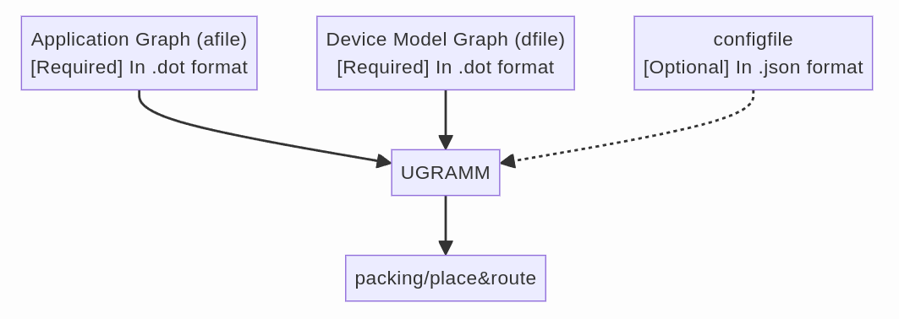
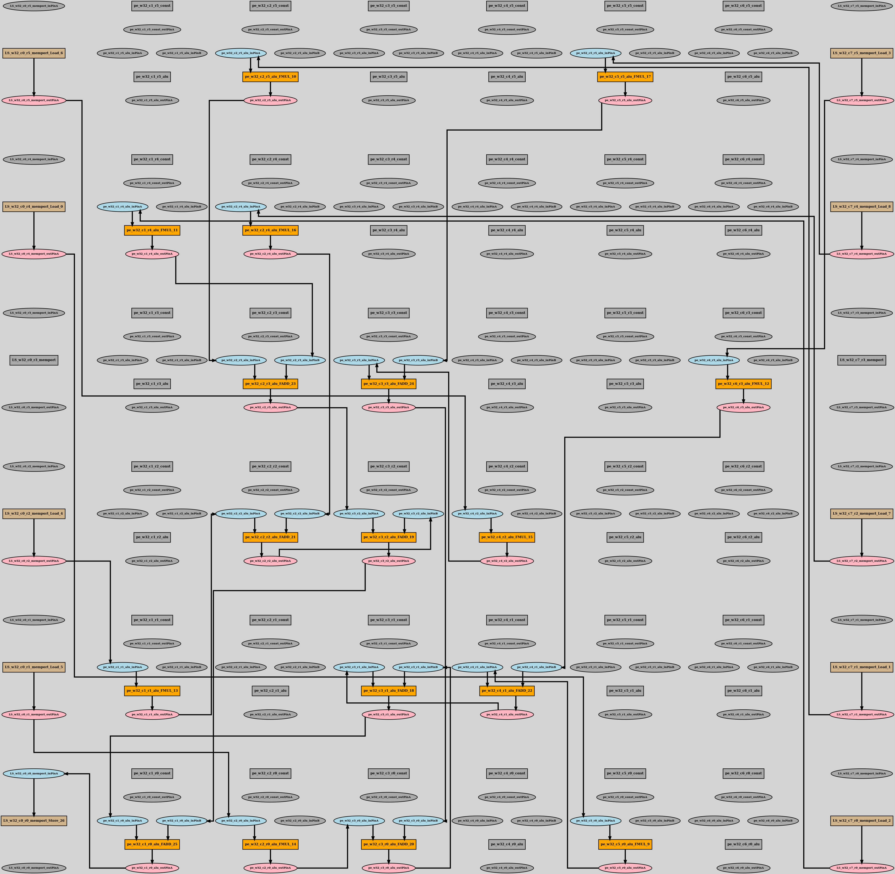
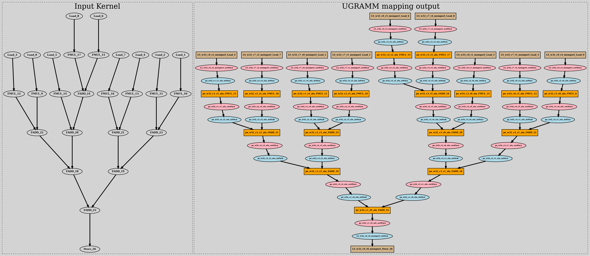

# Table of Contents

- [Getting Started](#getting-started)
- [Demo](#demo)
  - [Running UGRAMM](#running-ugramm)

---

# Getting started:

Clone the UGRAMM repository, navigate to its directory, and compile the source code. This process will generate a binary named `UGRAMM` in the root directory.

```
git clone https://github.com/UniversalGRAMM/UGRAMM.git
cd UGRAMM && make
```

The required and optional arguments for UGRAMM are as follows:

```
./UGRAMM --help
[UGRAMM] allowed options =:
  -h [ --help ]           Print help messages
  --seed arg              Seed for the run [optional]
  --verbose_level arg     0: info [Default], 1: debug, 2: trace [optional]
  --dfile arg             Device model file [required]
  --afile arg             Application graph file [required]
  --config arg            UGRAMM config file [optional]
  --drc_disable           disable DRC [optional]
  --max_iter arg          Maximum number of iterations UGRAMM will run
                          [optional; defaults to 40]
  --pfac_mul arg          Multiplier for present congestion cost [optional;
                          defaults to 1.1]
  --hfac_mul arg          Multiplier for history congestion cost [optional;
                          defaults to 2]
  --drc_verbose_level arg 0: err [Default], 1: warn, 2: info, 3: debug
                          [optional]
```

UGRAMM is a flexible tool that can be used not only for CGRA mapping but also for any application requiring the embedding of a small graph within a larger graph. The smaller graph is referred to as the application graph, while the larger graph is known as the device-model graph, into which we attempt to embed the application graph. More information about these graphs and how they are accepted in UGRAMM is provided below:

- UGRAMM primarily accepts three types of files:
    - **afile** [REQUIRED]: An application graph file in Graphviz DOT format [(ref)](https://graphviz.org/doc/info/lang.html). This file describes the input application to be mapped onto the device model (mapping here refers to verifying whether this smaller graph is a minor of the larger device-model graph).
    - **dfile** [REQUIRED]: A device model file, also in Graphviz DOT format. This file represents the hardware's device model, and the UGRAMM tool checks if the application graph (H) is a minor of this device model graph (G).
    - **config** [OPTIONAL]: An optional configuration file that can be used in scenarios such as skipping the placement of specific nodes or locking the placement of certain nodes.


<div style="text-align: center;">
    
    <figcaption style="font-size: 14px; color: #555;">Fig 1.UGRAMM inputs</figcaption>
</div>


# Demo:

A helper script (`run_ugramm.sh`) has been created to simplify the execution of UGRAMM. The operations performed by this script are outlined below. You can either run UGRAMM using this script or execute the commands directly.

```
❯ ./run_ugramm.sh --help
This helper script will generate a specific CGRA device model file based on user input; Compile, and run UGRAMM with the generated device model file as input. It will also convert the output of UGRAMM into PNG format for easier debugging and visualization.
Usage: ./run_ugramm.sh [SEED] [NR] [NC] [APPLICATION_GRAPH] [CONFIG_FILE]
Example: ./run_ugramm.sh 15 8 8 Kernels/Conv_Balance/conv_nounroll_Balance_Specific.dot config.json
```

The script performs the following operations in sequence:

1. **Generate the device model** using a script provided by UGRAMM, which creates a device model for CGRA:
    ```bash
    cd scripts && ./device_model_gen.py -NR 8 -NC 8 -Arch RIKEN && cd ..
    ```

2. **Execute UGRAMM** and produce mapping results in `positioned_dot_output.dot` and `unpositioned_dot_output.dot`:
    ```bash
    make && ./UGRAMM --seed 15 --verbose_level 0 --dfile scripts/riken_8_8.dot --afile Kernels/Conv_Balance/conv_nounroll_Balance_Specific.dot --config config.json
    ```

3. **Convert the mapped output DOT files into PNG format**:
    ```bash
    neato -Tpng positioned_dot_output.dot -o positioned_dot_output.png
    dot -Tpng unpositioned_dot_output.dot -o unpositioned_dot_output.png
    ```

4. The successful mapping results will be saved as `unpositioned_dot_output.png` and `positioned_dot_output.png`.

## Running UGRAMM:

The UGRAMM repository includes a variety of benchmarks for CGRA applications in the `Kernels/` folder, featuring benchmarks like Stencil, Convolution, and FFT. The following command maps the `conv_nounroll_Balance` benchmark onto an 8x8 RIKEN CGRA using a seed value of 15. After executing this command, the mapped output results should be available in the root directory of UGRAMM:

```
./run_ugramm.sh 15 8 8 Kernels/Conv_Balance/conv_nounroll_Balance_Specific.dot config.json
```

### **positioned_dot_output**: 

This dot-file contains user provided co-ordinates of the device-model node cells.

<div style="text-align: center;">
    
    <figcaption style="font-size: 14px; color: #555;">Fig 1. positioned_dot_output</figcaption>
</div>

### **unpositioned_dot_output**: 

This dot-file does not contains user provided co-ordinates of the device-model node cells. This file also displays the input application graph for which UGRAMM was executed.

<div style="text-align: center;">
    
    <figcaption style="font-size: 14px; color: #555;">Fig 2. unpositioned_dot_output</figcaption>
</div>
