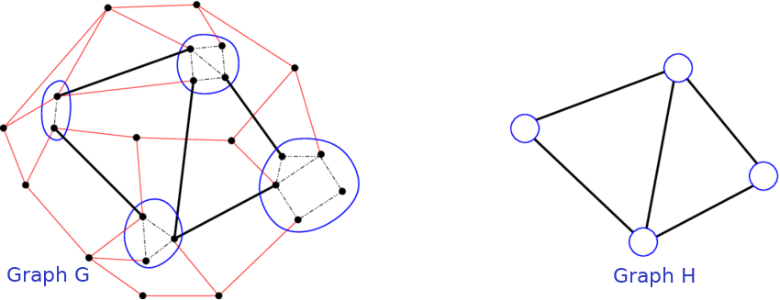

# Introduction to UGRAMM:

  <a href="/getting-started" class="btn btn-primary fs-5 mb-4 mb-md-0 mr-2">Get started now</a>
  <a href="https://github.com/UniversalGRAMM/UGRAMM" class="btn fs-5 mb-4 mb-md-0">View it on GitHub</a>

 

  GRAMM (GRAph Minor Mapping) is a novel CGRA mapping technique that has demonstrated an 80x CAD runtime speedup over other mapping methods <a href="https://ieeexplore.ieee.org/document/10296406">[Zhou et al.(2023)]</a>. GRAMM is based on the graph minoring concept from graph theory, which states that if we can transform graph G into H by removing its nodes and/or edges and as well by contracting edges in G, then graph H is a minor of graph G. In the graph minor example in Fig.1, red edges in graph G are removed and edges within blue circles are contracted, resulting in graph H as a minor of graph G.    

    
    <figcaption style="font-size: 14px; color: #555;">Fig 1. Graph Minor example</figcaption>

This repository contains a more general version of GRAMM known as UGRAMM (Universal GRAph Minor Mapper), which can not only be used in CGRA mapping but as well could be easily incorporated in any other applications such as ASIC/FPGA packing, etc.    

{: .note }
<b> If referred, kindly cite the research using: </b>  
G. Zhou, M. Stojilović and J. H. Anderson, "GRAMM: Fast CGRA Application Mapping Based on A Heuristic for Finding Graph Minors," 2023 33rd International Conference on Field-Programmable Logic and Applications (FPL), Gothenburg, Sweden, 2023, pp. 305-310, doi: 10.1109/FPL60245.2023.00052.

# License:

- The UGRAMM toolchain is licensed under this [License](https://github.com/UniversalGRAMM/UGRAMM/blob/master/LICENSE). Please review it before using UGRAMM.

[Jekyll]: https://jekyllrb.com
[Markdown]: https://daringfireball.net/projects/markdown/
[Liquid]: https://github.com/Shopify/liquid/wiki
[Front matter]: https://jekyllrb.com/docs/front-matter/
[Jekyll configuration]: https://jekyllrb.com/docs/configuration/
[ugramm repo]: https://github.com/UniversalGRAMM/UGRAMM
